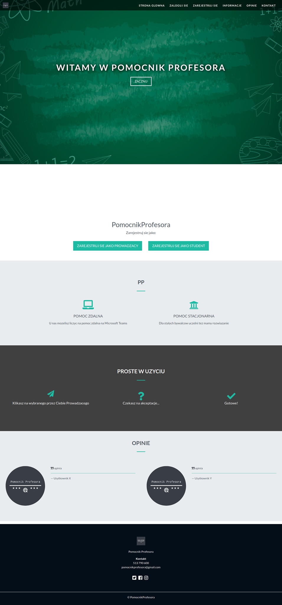
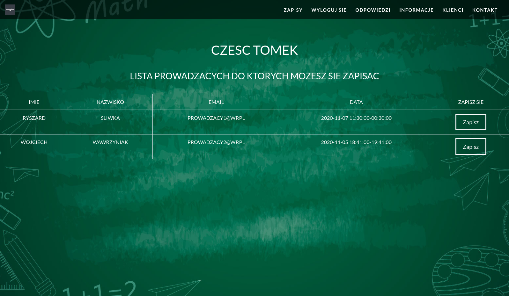
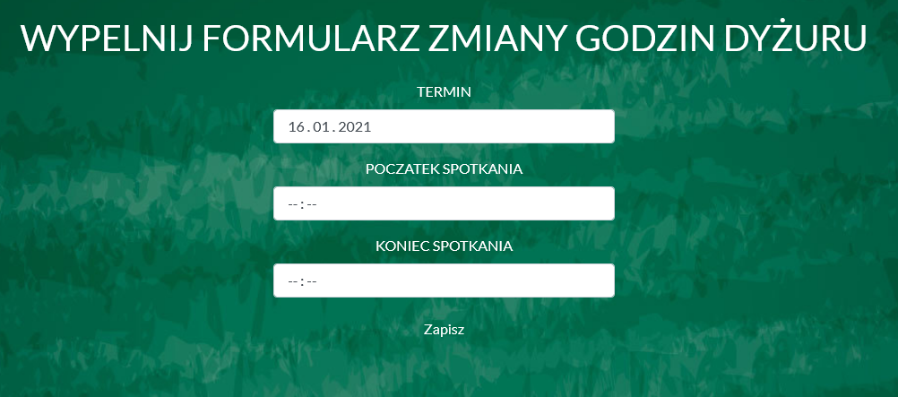

# Pomocnik Profesora
> Project what make teachers and students work easier.

## Table of contents
* [General info](#general-info)
* [Screenshots](#screenshots)
* [Technologies](#technologies)
* [Setup](#setup)
* [Features](#features)
* [Status](#status)
* [Contact](#contact)

## General info
Microserwis of one bigger application https://s153070.projektstudencki.pl/. This services are connected with REST API. You can login only if you are student or teacher from WMI UAM Poznan. Its LDAP login system.
You can get extra lesson in your school or university, if u have any problem in subject or want to be better then you were yesterday!

## Screenshots

## Technologies
* Python
* Flask
* SQLAlchemy
* HTML 
* CSS, Bootstrap

## Setup
You need to have python3 installed. In project folder: 
* `pip3 install -r requirements.txt`
* `export FLASK_APP=PomocnikProfesora.py`
* `flask run`

## Features
* Student can entry to extra lessons
* Teachers can reject or accept lesson
* Student see Teachers decision
* Teacher can update his date of meeting
* Automatic deletion entry after 14 days

## Status
Project is: _finished_

## Contact
Created by Pawel Rozplochowski
